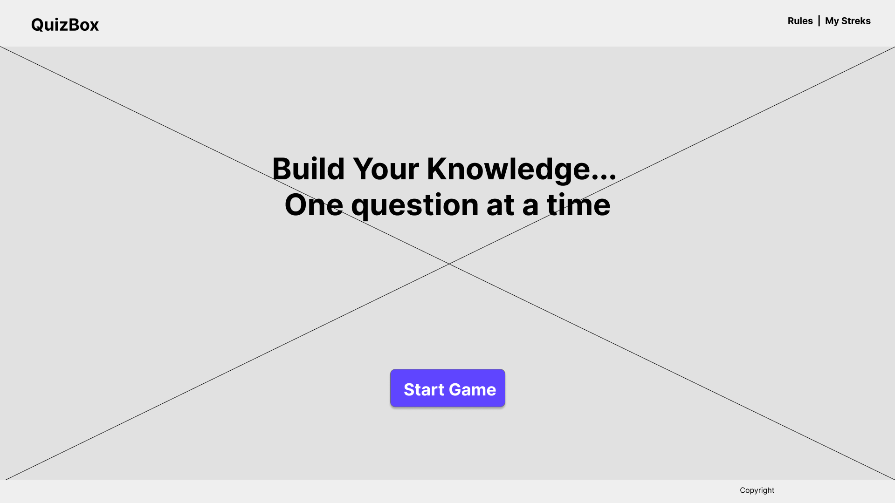
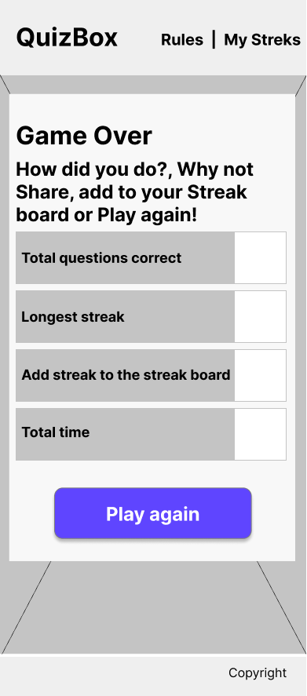
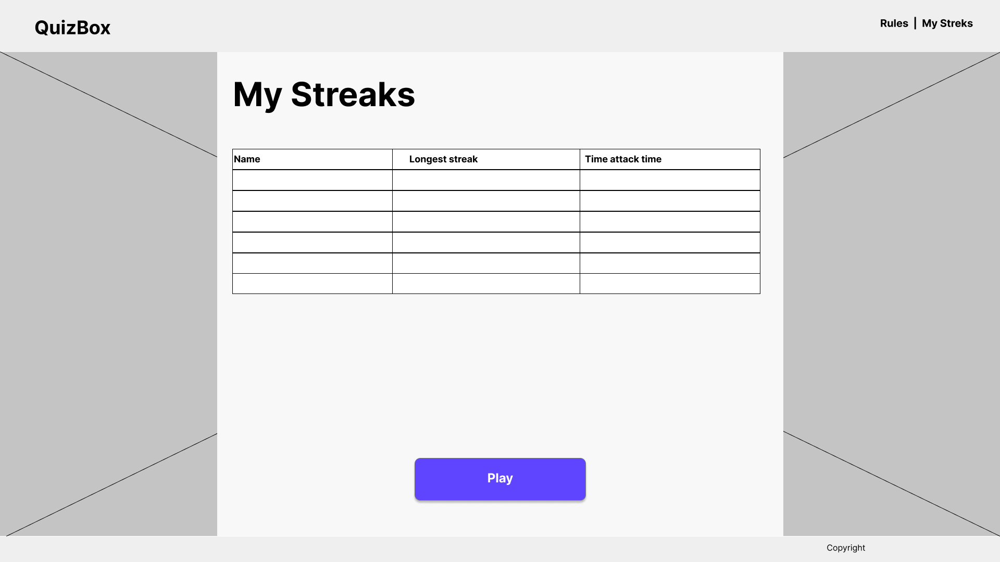

# QuizBox an interactive quiz game  
  
QuizBox is a questions and answers quiz based interactive game which encourages children from late primary school age through to secondary school age to answer questions to help them improve their general knowledge broadly.  
[Live site](https://jhodgkins.github.io/MSP2-Quiz/)  

## Table of contents
1. [Overview](#overview)
2. [Design brief](#design-brief)
3. [Research](#research)  
4. [Goals and Target audience](#goals-and-target-audience)  
    4.1 [Project goals](#project-goals)  
    4.2 [User goals](#user-goals)  
    4.3 [Site owners goals](#site-owners-goals)  
    4.4 [Target audience](#target-audience)  
5. [User experiance (UX)](#user-experiance-ux)  
    [User stories](#user-stories)  
    5.1 [First time user](#first-time-user)  
    5.2 [Returning user](#returning-user)  
    5.3 [Site owner](#site-owner)  
6. [Design](#design)  
    6.1 [Structure of pages](#structure-of-pages)  
    - [Header](#header)  
    - [Main content area](#main-content-area)  
    - [Game content area](#game-content-area)  
    - [Footer section](#footer-section)  

    6.2 [Wireframes](#wireframes)  
    - [Landing page](#landing-page)  
    - [How to page](#how-to-page)  
    - [Game start page](#game-start-page)  
    - [Game question layout](#game-question-layout)  
    - [Streak banner layout](#streak-banner-layout)  
    - [Rules page](#rules-page)  
    - [Game over page](#game-over-page)  
    - [Streak leader board page](#streak-leader-board-page)  
    6.3 [Colour palette](#colours-palette)  
    6.4 [Typography](#typography)  
    6.5 [Icons and imagery](#icons-and-imagery)  
7. [Features](#features)  
    7.1 [Existing features](#existing-features)  
    7.2 [Features to be implimented in future releases](#features-to-be-implimented-in-future-releases)  
8. [Testing](#testing)  
9. [Technologies used](#technologies-used)  
    9.1 [Languages](#languages)  
    9.2 [Frameworks and libraries](#frameworks-and-libraries)  
    9.3 [Programs and online resources](#programs-and-online-resources)  
10. [Deployments](#deployments)  
    10.1 [Deploying to GitHub Pages](#deploying-to-github-pages)  
    10.2 [Forking the GitHub Repository](#forking-the-github-repository)  
    10.3 [Cloning to GitPod](#cloning-to-gitpod)  

## Overview
The QuizBox web application is a question and multiple-choice answer quiz presented in an easy and intuitive way which can be understood and used by late primary to senior school aged children.  
The QuizBox web application has been developed with its main purpose to provide a fun game for children who like to play games on their or their parents smart devices, an alternative which appeals to the target audience but benefits from also educating them.  
The business purpose of the platform is to build an established community which promotes learning can be fun, to take small steps in learning and encourage improvement through daily return playthroughs.  
The sites expected target audience will be to those that would like to 
Play and increase their knowledge, play with friends or parents looking to provide their children with a game which aids their child’s learning.  

The website application will provide to new visitors a positive feeling demonstrating a bright simple to use interface with an easy to pick up and play approach with the games purpose being evident in its design and user experience throughout.  

The application adds a gamifying aspect which encourages users to continue answering questions to increase their streak/correct answer total, doing this increases difficulty as thinking is needed to avoid breaking the streak.  

## Design brief
Plan, design and build an interactive website application for children and young adults which provides a game-based approach to learning new general knowledge, encourages curiosity about the world we live in, which will help build a community of quizzers and promote education learning through a fun interactive game application.  
The project will provide a safe and fun learning experience for children to learn at their own pace no matter any learning difficulties or disabilities, with added functionality to show their progress with others through the application.  

## Research
Please view the [research](docs/research/RESEARCH.md) document for details of user research carried out through the planning phase.  

## Goals and Target audience  
### Project goals  
- The project will provide a platform for those interested in playing quizzes a place to visit frequently where they can test their knowledge and learn new knowledge and share their accomplishments and progress with others.  
- The project will promote the QuizBox application to parents and young adults as a form of fun interactive learning material.  
- The project will help build a community of quizzers looking to challenge each other through the streaks system.  

### User goals  
- Find information about what QuizBox is  
- Find information about how to play QuizBox  
- Quickly and easily start playing the quiz  
- Find information about how other people have done taking the quiz  
- Find information about when the application has new content.  

### Site owners goals  
The QuizBox site owner is interested in promoting the apps approach, learning through play and its possible benefits to young adults who struggle to learn by standard means.  
The site owner would also like to achieve additional goals which include:  
- Provide an application that can be easily used by parents and children cooperatively as an extra form of learning material.  
The platform uses child friendly questions which provides a place parents can learn to trust as a safe resource for their child to learn within.
- Provide a way for parents to find out when new questions have been added to the quiz and request new categories.  

### Target audience  
- Children aged 10 to 16 years of age  
- Those with learning difficulties or disabilities who learn easier through play and interaction  
- Parents of the children’s target age range looking for an additional resource they can use to help increase their child’s knowledge.  
- Family who plays the game as a group together as a form of entertainment.
- Schools looking for a resource that tests general knowledge.  

## User experiance (UX)  
During project planning, it was decided to set an aim that all User journeys should aim to be completed in 3 clicks or less to provide an overall good user experience and provide a positive feeling when navigating and interacting with the application and website.  
As the application is aimed at a younger audience, click, tap targets have been increased to ensure no barriers are present or experienced during playthrough.  
Keyboard and screen reader navigation has also been considered and all elements can be reached using a keyboard to ensure the application is as accessible as possible to all users of the application.  

### User stories  
#### First time user  
- As a first-time user, I want to understand what the applications purpose is so that I can decide if it interests me.  
- As a first-time user, I want to be able to easily navigate to the game application.  
- As a first-time user, I want to find out more about QuizBox.  
- As a first-time user, I want to find out the rules of the game.  
- As a first-time user, I want to find out which questions I have got correct.   
- As a first-time user, I want to find out what my question streak count is.   
- As a first-time user, I want to be able to restart the game.  
- As a first-time user, I want to receive encouragement if I struggle to answer the questions.  

### Returning user  
- As a returning user, I want to know if there have been any new questions added.
- As a returning user, I want to be able to invite a friend so we can challenge each other.
- As a returning user, I want to be able to play the game without visiting the main website page first.  
- As a returning user, I want to be able to beat my previous score.  
- As a returning user, I want to receive a new set of questions to answer.  
- As a returning user, I want to be able to ask a question about the application.  

### Site owner  
- As the site owner, I want visitors to find QuizBox approachable and know its purpose.
- As the site owner, I want visitors to understand what the rules of the game are.  
- As the site owner, I want visitors to be able to invite their friends and family to challenge each other.
- As the site owner, I want the site visitors to be able to contact QuizBox and request new categories or questions.

## Design  
The application was designed to be clean, clear and easily understood by its target audience, header and footer sections persist throughout the landing page and game application page to ensure navigation is kept consistent as to provide easy navigation and a pleasant user experience (UX).    
The application uses primary colours to reflect a bright and colourful, playful feeling.  
As a person with a visual impairment, the website has been designed with screen magnification and screen readers in mind.  

### Structure of pages  
The landing page website and application use a mobile first approach with the landing page having a maximum width of 1140px which centre aligns at higher resolutions and the application page following suit with a game area of the same width constraints to maintain the user’s focus, attention and sight lines.  

#### Header  
The landing page and application follow a universal approach which comprises of a left aligned logo for Mobile through to Desktop.  
To the right is the applications main navigation, which is responsive, full text links remain right aligned until tablet size and below where it will collapse to a right aligned Hamburger menu (toggle button).  
On devices tablet and below the user will be able to expand/collapse this menu using the menu toggle button.  

#### Main content area
The main content area is used to display content dynamically dependant on the user’s choice of action, when arriving on the landing page, this area is used to hold 3 large sections each with a simple to understand description and single call to action button.  
The areas are top section which briefly outlines the game with a call-to-action button inviting users to start the game followed by a middle section which contains a simple form inviting visitors to invite friends to the website and play QuizBox.  
Selecting to play now will load the game area which is detailed below.  

This approach was used to ensure that the user felt comfortable within the website and application, encompassing content within the header allowing the user to become familiar with the site navigation and always know how to navigate away or too their chosen area.  

#### Game content area
After a user has selected to play the game, the main area is filled with a game area, all game content required to take the quiz and proceed through all screens is presented to the user centrally within this area to ensure consistency, reassure a user of what to do and maintain a clean, clear user interface.  

#### Footer section
The footer section was designed to be useful and useable; the footer is divided into two half page sections at tablet and above screen sizes, dependant on if they are on the landing page or within the game application.  
The left side if within the the landing page it will shows QuizBox social media links or when within the application these have been removed.  
The reasoning behind this is to provide social links but not force social media on those playing who may not have access. This provides an effective way to offer online features but not force them.  
The right side displays a copyright notice when on the landing page and when within the game application.   

### Wireframes
Wireframe designs show Mobile, Tablet and Desktop views of the main concept and parts of the application.  
The application was developed using a mobile first approach.  
#### Landing page  

Mobile

Tablet

Desktop

  
  
#### How to page  

Mobile

Tablet

Desktop

  

#### Game start page

Mobile

Tablet

Desktop

  

#### Game question layout

Mobile

Tablet

Desktop

  

#### Streak banner layout

Mobile

Tablet

Desktop

  

#### Rules page

Mobile

Tablet

Desktop

  

#### Game over page

Mobile

Tablet

Desktop

  

#### Streak leader board page

Mobile

Tablet

Desktop

  

### Colours palette. 
   
- Sunglow: #FFC845 was used as this represents the sun glowing in the sky.  
- Prussian blue: #1B365D was used to represent a blue sky matching the sunglow yellow.  
- White: #FFFFFF was used as the main game background to represent clouds.  
The three remaining colours were used in specific areas, fern green was used as a primary colour to represent a correct answer whilst rusty red was used as an incorrect answer.  
Electric purple was used as a highlight colour and was used as it is a neutral colour liked by all genders.  
- Fern green: #58804D
- Rusty red: #DA344B
- Electric purple: #AA35FD
Other standard colours used were black.  
I used a tool called Contrast Grid [view live colour palette](https://contrast-grid.eightshapes.com/?version=1.1.0&background-colors=&foreground-colors=%231b365d%0D%0A%23DA344B%0D%0A%23ffc845%0D%0A%2358804D%0D%0A%23ffffff%0D%0A%23000000%0D%0A%23AA35FD&es-color-form__tile-size=compact&es-color-form__show-contrast=aaa&es-color-form__show-contrast=aa) to determine the foreground and background combinations to ensure a minimum contrast ratio of 4.5:1 was maintained.  
 

### Typography  
Fonts used across the site and application were provided by Google fonts and were used in certain areas as to maintain readability.  
The two font families used were, Electrolize and Poppins, the fonts have a default fall-back of Sans-Serif.  
Heading elements of the site used: Electrolize, which gives a robotic style to match imagery with Poppins being used across the remainder of site and application elements, to improve readability for users, the base font size was also set to 18px from the browser default 16px.  

### Icons and imagery  
The icon used on the main site was provided by Font Awesome free icon set with the image of a happy robot from freesvg.org.  
The icon was selected to represent something being sent to recognise the meaning of the section content.  
The icon can be scaled to high magnification levels and remain clear and sharp.  
The robot image was used as it appears cheerful and happy, as the application wishes users to feel while playing.  
  
Social media icons for Facebook, twitter and Instagram were also used.  

## Features  
This section looks at features which were implemented and those that with further research and knowledge will add to the existing set of features.  
#### Existing features  
- Responsive website application which reflows up to 500% zoom using browser zoom.  
- Responsive navigation menu bar.  
- Form validation with visual feedback given through on screen markers, surrounds including successful form submission message.  
- User feedback alerts including encouragement messages.  
- Simple logical layout.  
- Streak counter which tracks correct answer flows and records longest streak to user at game end.  
- Accessible using assistive technologies.  
#### Features to be implimented in future releases  
- Provide local storage to store previous resuts.  
- Create an API with selected appropriate questions to support the application.  
- Allow users/parents to log in and see progress over time.  
- Provide other types of question alongside multiple choice.  

## Testing  
The testing document has been written in a seperate file, please see [TESTING](docs/testing/TESTING.md)  

## Technologies used  
A list of all technologies and software and online resources used to create the QuizBox application.  
### Languages  
-  [HTML](https://en.wikipedia.org/wiki/HTML5)  
-  [CSS](https://en.wikipedia.org/wiki/CSS)  
-  [JS](https://en.wikipedia.org/wiki/JavaScript)  

### Frameworks and libraries  
-  [Bootstrap version 5.0.2](https://getbootstrap.com/)  
-  [Font Awesome](https://fontawesome.com/), Icons used throughout the site.  
-  [Google fonts](https://fonts.google.com/), Source sans pro and Poppins fonts were used across the site.  
-  [EmailJS](https://www.emailjs.com/), used for sending emails through forms.  

### Programs and online resources  
-  [favicon.io](https://favicon.io) used to create the favicon.
-  [GitHub](https://github.io), was used to store committed files
-  [Git](https://git-scm.com/) and [Gitpod](https://gitpod.io/), used in conjunction through Gitpod to commit and push files to GitHub
-  [Photoshop 2021](https://adobe.com), used for editing of screenshots.  
-  [Figma](https://www.figma.com/), used to create the wireframe designs of the applicaion.
-  [Colour scheme](https://coolors.co/9cd5f4-fde06f-133c55-386fa4-678d58), used to create a colour palette.  
-  [Lighthouse](https://developers.google.com/web/tools/lighthouse), used to test performance, accessibility, best practices, and SEO within the Chrome browser.
-  [Am I Responsive](http://ami.responsivedesign.is/), used for generating the main README image.  
-  [CSS Minifier](https://www.toptal.com/developers/cssminifier/), used to minify CSS.  

## Deployments  
Please find below the steps on how to Deploy, Fork and Clone.  
### Deploying to GitHub pages  
This milestone project was deployed to GitHub Pages using the following steps.  
1.	Log in to GitHub and then locate the GitHub Repository
2.	On the top menu of the Repository, code is selected in the menu at the right is the "Settings" Button, select this link on the menu.
3.	Settings will open, scroll down the Settings page until you find the "Pages" Section.
4.	Under "Source", select the dropdown which displays "None" and select "Main".
5.	The page will automatically refresh.
6.	Scroll back down through the page to locate the now published site link in the "GitHub Pages" section, this will take a few minutes before the link shows your page.  

### Forking the GitHub repository  
Forking a GitHub Repository will make a copy of the original repository on your GitHub account to view, edit or make changes without worrying about affecting the original repository.
1.	Log in to GitHub and locate the GitHub Repository you wish to fork
2.	At the top of the Repository, to the right above the "Settings" link on the menu, locate the "Fork" Button and select.
3.	You should now have a copy of the original repository within your GitHub account.  

### Cloning to Gitpod  
1.	Go to [gitpod.io](https://gitpod.io)
2.	Create an account or sign in
3.	Open a new window and navigate to the extension store of your browser
-   [Chromium browsers](https://chrome.google.com/webstore/detail/gitpod-online-ide/dodmmooeoklaejobgleioelladacbeki)
-   [Firefox](https://addons.mozilla.org/firefox/addon/gitpod/)
4.	Accept permissions for the extensions and then return to the repository you wish to clone.
5.	There should be a green Gitpod button now located to the right, selecting this will open GitHub new repository screen.
6.	Create a new repository and Gitpod will launch your new repository into the user interface.  
### Making a local clone  
1.	Log in to GitHub and locate the GitHub Repository  
2.	Locate the Code button located to the right of the screen, click on this to reveal a sub menu, "Clone or download a zip file should be seen".  
3.	To clone the repository using HTTPS, under "Clone with HTTPS title", copy the link to your clipboard.
4.	Open Git Bash  
5.	Change the current working directory to the location where you wish the cloned directory to be made.  
6.	Type git clone, and then paste the URL you copied above. e.g., $ git clone https://github.com/YOUR-USERNAME/YOUR-REPOSITORY 
7.	Press Enter and your local clone will start to be created.  

