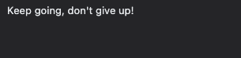

# Tests performed  
This document details how the QuizBox website and application were tested to ensure that complience and good user experiance were achieved and to make the application as accessible to all its users.  

## Table of contents  
1. [User stories](#user-stories)  
    1.1[First time user](#first-time-user)  
    1.2 [Returning user](#returning-user)  
    1.3 [Site owner](#site-owner)  

## User stories  
### First time user  
- As a first-time user, I want to understand what the applications purpose is so that I can decide if it interests me.  
When a first time user arrives at the site, they will immediately be presented with a bold and easy to understand message that describes the objectives of the game.  
A new visitor would be immediately aware of the applications purpose.  
  

- As a first-time user, I want to be able to easily navigate to the game application.  
Located on the right along the navigation bar is a highlighted button which reads ‘Go to QuizBox’, there is also a button located below the games introductory text which reads the same.  A first time user would be able to go to the application in a multiple of ways.  
  

- As a first-time user, I want to find out more about QuizBox.  
The footer section contains three social media links, these can be visited by users to view QuizBox social channels where information about the application will be posted.  
  

- As a first-time user, I want to find out the rules of the game.  
Located within the navigation area, there is a rules link.  
This link will open a modal box which displays 3 simple rules about navigating the application and to not use browser controls. During testing this was decided was the best implementation as the modal could be activated no matter the place within game or on the website.  
  

- As a first-time user, I want to find out which questions I have got correct.  
The application provides an easy to see progress area, this shows answers which have been answered correct as well as those that were incorrect.
Correct answers are shown filled with green and incorrect answers are filled with red.  
  

- As a first-time user, I want to find out what my question streak count is.  
Located above the prohress indicator is an area which reads ‘current streak, this will show the users current streak and if a question is incorrect the counter will reset to 0.  
The longest streak through the game is retained for the user.  
  

- As a first-time user, I want to be able to restart the game.  
Located on the navigation bar while the application is running will be a button labelled ‘Restart QuizBox’ selecting this will return the user to the start game screen ready to start again.  
  

- As a first-time user, I want to receive encouragement if I struggle to answer the questions.  
The game has several encouragement messages to keep the user engaged and encourage them to carry on, these read ‘Keep going, don’t give up!’, it is hoped this will encourage user to carry on, these massages are based on if there are incorrect answers given in a row.  
  

### Returning user  
- As a returning user, I want to know if there have been any new questions added.  
- As a returning user, I want to be able to invite a friend so we can challenge each other.  
- As a returning user, I want to be able to play the game without visiting the main website first.  
- As a returning user, I want to beat my previous score.  
- As a returning user, I want to receive a new set of questions to answer.  

### Site owner  
