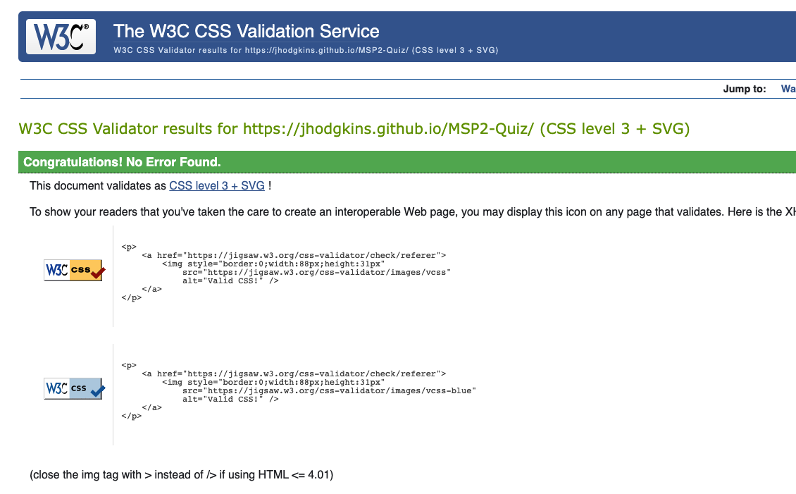

# Tests performed  
This document details how the QuizBox website and application were tested to ensure that complience and good user experiance were achieved and to make the application as accessible to all its users.  

## Table of contents  
1. [User stories](#user-stories)  
    1.1[First time user](#first-time-user)  
    1.2 [Returning user](#returning-user)  
    1.3 [Site owner](#site-owner)  
2. [Testing overview](#testing-overview)  
3. [Test results overview](#test-results-overview)  
4. [Validation Testing](#validation-testing)  
    4.1 [HTML validation](#html-validation)  
    4.2 [CSS validation](#css-validation)  
    4.3 [JS validation](#js-validation)  
5. [Manual tests](#manual-tests)  
    5.1 [Rendering in browser & Reflow test](#rendering-in-browser--reflow-test)  
    5.2 [Link testing](#link-testing)  


## User stories  
### First time user  
- As a first-time user, I want to understand what the applications purpose is so that I can decide if it interests me.  
When a first time user arrives at the site, they will immediately be presented with a bold and easy to understand message that describes the objectives of the game.  
A new visitor would be immediately aware of the applications purpose.  
  

- As a first-time user, I want to be able to easily navigate to the game application.  
Located on the right along the navigation bar is a highlighted button which reads ‘Go to QuizBox’, there is also a button located below the games introductory text which reads the same.  A first time user would be able to go to the application in a multiple of ways.  
  

- As a first-time user, I want to find out more about QuizBox.  
The footer section contains three social media links, these can be visited by users to view QuizBox social channels where information about the application will be posted.  
  

- As a first-time user, I want to find out the rules of the game.  
Located within the navigation area, there is a rules link.  
This link will open a modal box which displays 3 simple rules about navigating the application and to not use browser controls. During testing this was decided was the best implementation as the modal could be activated no matter the place within game or on the website.  
  

- As a first-time user, I want to find out which questions I have got correct.  
The application provides an easy to see progress area, this shows answers which have been answered correct as well as those that were incorrect.
Correct answers are shown filled with green and incorrect answers are filled with red.  
  

- As a first-time user, I want to find out what my question streak count is.  
Located above the prohress indicator is an area which reads ‘current streak, this will show the users current streak and if a question is incorrect the counter will reset to 0.  
The longest streak through the game is retained for the user.  
  

- As a first-time user, I want to be able to restart the game.  
Located on the navigation bar while the application is running will be a button labelled ‘Restart QuizBox’ selecting this will return the user to the start game screen ready to start again.  
  

- As a first-time user, I want to receive encouragement if I struggle to answer the questions.  
The game has several encouragement messages to keep the user engaged and encourage them to carry on, these read ‘Keep going, don’t give up!’, it is hoped this will encourage user to carry on, these massages are based on if there are incorrect answers given in a row.  
  

### Returning user  
- As a returning user, I want to know if there have been any new questions added.  
Located on the homepage within the footer are QuizBox social links, it is hoed that users, parents will interact with these pages and this will be the one form of communication to release new content such as questions.  
  

- As a returning user, I want to be able to invite a friend so we can challenge each other.  
Located within section two of the main landing page is a form which gives details on how to complete, it asks for the friends name and email address which will send an invite to the website address for the friend to visit and then play QuizBox.  
  

- As a returning user, I want to be able to play the game without visiting the main website first.  
The application comprises of two parts, the main website page which introduces the QuizBox game and a game landing page which can be bookmarked for easier navigation or added to a devices home screen using a mobile device.  
This will allow for users to go straight to playing the game.  
  

- As a returning user, I want to beat my previous score.  
At present this will be done by the user using memory or noting it down, this is a feature which QuizBox would like to implement in the future.  
At present the user is presented with their score at the end of each game.  
  

- As a returning user, I want to receive a new set of questions to answer.  
Currently there is a set of 15 questions which are shuffled on each playthrough, as more questions are added it is expected that no two questions will arise on multiple playthroughs and when they do will help users to memorise and take in the information.  
Similar to a look cover check approach.  
  

### Site owner  
- As the site owner, I want visitors to find QuizBox approachable and know its purpose.  
On the main website page and the game launch page, QuizBox outlines its main purpose and what the user is expected to do.  
Keeping the messaging clear makes the application available to a wide audience.  

- As the site owner, I want visitors to understand what the rules of the game are.  
The only rules set are two which are to help the user navigate through the quiz, if a user uses the back button or refreshes the page the game would be interrupted.  
The final rule is to have fun which is what QuizBox is all about learning through play.  

- As the site owner, I want visitors to be able to invite their friends and family to challenge each other.  
The simple form provided to the user is designed as to be as accessible to all with clear fields which require information.  
Once a friend receives an email it is then up to them to visit the site and no further nagging spam emails will be sent.  

- As the site owner, I want the site visitors to be able to contact QuizBox and request new categories or questions.  
Providing social media channels enables those that choose to talk and share their experience, ask or send further questions.  
Sharing will enable new people to visit the game and QuizBox can  be a source for those who find it useful.  

## Testing overview  
__Automated testing__  
Automated tests were carried out using the browser incognito mode to eliminate extension conflicts or false positives or errors due to the extension requests.  

__Manual testing__  
All manual testing was carried out in standard browser mode to simulate a users experience of the website and application.  

__Accessibility extensions__  
All results from accessibility extensions were verified using manual tests and where relevant were validated using Screen Reader software.  

__Screen reader software__  
NVDA and JAWS and VoiceOver were used in some tests, this is software which I own and was run in real time and not simulated.  

## Test results overview  
Below is a table which shows an overview of the various tests undertaken, results of tests were stored in an Excel document for functionality and accessibility reasons, the excel document contains 3 sheets of tests.  
Please find the issues.xlsx file on the GitHub repository or view on Dropbox.  
 
| Test             | Homepage | Game landing page | Game |
|------------------|----------|-------------------|------|
| HTML Validation  | PASS     | Pass              | PASS | 
| CSS Validation   | PASS     | N/A               | N/AS | 
| JDhint           | PASS     | PASS              | PASS | 
| Links            | PASS     | PASS              | PASS | 
| Landmark / Regio | PASS     | PASS              | PASS |
| Screen reader    | PASS     | PASS              | PASS |
| Lighthoise - <br>Performance,<br>Accessibility,<br>Best practice,<br>SEO | PASS         | PASS         | PASS          |

## Validation testing  
### HTML validation  
-  Homepage - [PASS | Validation link](https://validator.w3.org/nu/?doc=https%3A%2F%2Fjhodgkins.github.io%2FMSP2-Quiz%2Findex.html)    
  
-  Game landing/game - [PASS | Validation link](https://validator.w3.org/nu/?doc=https%3A%2F%2Fjhodgkins.github.io%2FMSP2-Quiz%2Fgame-landing.html)    
  

### CSS validation
-  Homepage - [PASS | Validation link](https://jigsaw.w3.org/css-validator/validator?uri=https%3A%2F%2Fjhodgkins.github.io%2FMSP2-Quiz%2F&profile=css3svg&usermedium=all&warning=1&vextwarning=&lang=en)  
  
-  Game landing/game - [PASS | Validation link](https://jigsaw.w3.org/css-validator/validator?uri=https%3A%2F%2Fjhodgkins.github.io%2FMSP2-Quiz%2Fgame-landing.html&profile=css3svg&usermedium=all&warning=1&vextwarning=&lang=en)  
  

### JS validation  
  

## Manual testing  
### Rendering in browser & Reflow test  
Devices used: Windows 10 PC, Mac Studio, iPad Air 2, iPhone X  
Desktops  
-  Chrome, EDGE, Firefox on PC - PASS  
-  Safari, Chrome on Mac - PASS  
Tablet and mobile
-  Safari - PASS  
I found that the website and application reflowed and displayed correctly and as expected on different screen sizes and systems.  

### Link testing  
All links on the site were tested to ensure that internal links behaved correctly, and that external facing links such as social media links opened a new tab as expected.  
A screen reader was used during these tests on PC and MAC to ensure that the Sr-Only help text classes which have been applied were announced correctly by the screen reader software.  
an example of the code is shown below:  
```
<a class="nav-link" href="#" data-bs-toggle="modal" data-bs-target="#quizboxModal">rules
                <span class="sr-only">(opens a modal window)</span>
              </a>
```  


 